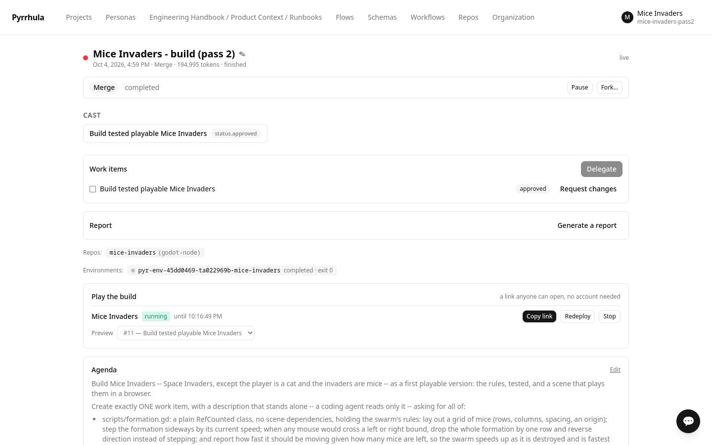
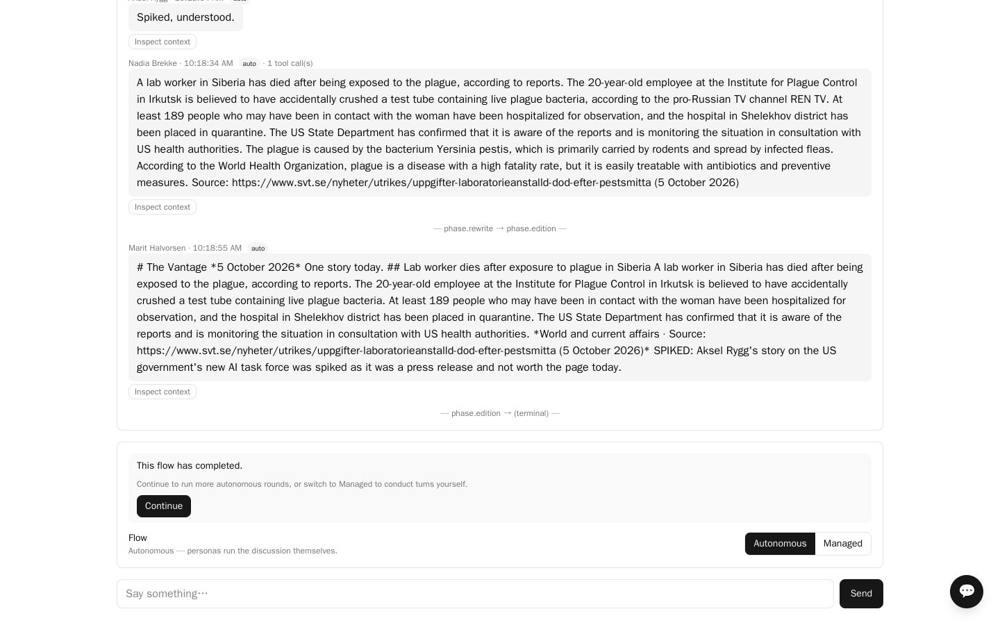

# Pyrrhula samples

Nine ready-made workspaces you can import into a fresh Pyrrhula deployment and run. Each
one is a `.pyr` file plus a step-by-step README that assumes you have never used Pyrrhula
before, and every step is something you do in the product — no sample asks you to run a
script. The one exception is standing up a piece of software that is genuinely separate
(the mystery's forensic lab, a local model server).

| Sample | What it shows | Agents |
|---|---|---|
| [hagnaryd-mystery](hagnaryd-mystery/) | Six agents, each with private briefs the others cannot see. A closed-house murder where the culprit has to survive an interrogation. | 6 |
| [karsh-vale](karsh-vale/) | A Basic Fantasy RPG one-shot where lore sits in three bands — common talk, guild knowledge, and the referee's own history — and no player character can retrieve what their character never learned. The simpler of the two tabletop samples. | 4 |
| [greyfen-barrows](greyfen-barrows/) | The same game at full size: an eight-beat campaign carrying the whole Basic Fantasy rulebook, 482 sections, so encounters use creatures that are actually in the book. Written end to end by Pyrrhula's own workspace assistant rather than by hand. | 4 |
| [coffee-campaign](coffee-campaign/) | A working session that produces a launch plan, where two people at the table hold commercially confidential facts they must not put in public copy. | 4 |
| [mice-invaders](mice-invaders/) | A lead and a developer building a small game in two parts: first they talk an increment through (no repository needed), then the developer builds it for real in a Godot repository through a coding harness, runs the tests and opens a pull request. The bundle carries the Godot image, so there is nothing to build. | 2 + 2 |
| [toddler-keyboard-chaos](toddler-keyboard-chaos/) | A lead and a senior developer building a real desktop app in a forked repository, where the developer works through a **coding harness** — an agent loop with a shell that reads, edits and runs the tests before anything is committed. Ends in a pull request on your own fork, reviewed under a second identity. | 2 |
| [loxia](loxia/) | A real repository on a git host: the bench plans against an analyzed codebase, opens pull requests, and refuses to merge a red build. | 6 |
| [pyrrhula](pyrrhula/) | Pyrrhula working on its own codebase: an architect, a tiered bench of four developers and QA, holding the project's invariants. | 6 |
| [newsroom](newsroom/) | A two-desk daily paper, every seat on a local model, that has to publish this week's news with a source and a date on every story — the one sample whose output is false if the internet was not reached. Read its **What this sample does not do well** first: the searching is real and provable, but the prose is unreliable — run it to watch the machinery, not to read the paper. | 3 |

**Start with [hagnaryd-mystery](hagnaryd-mystery/)** if you want to see what makes
Pyrrhula different from a group chat with several prompts in it.

<table>
<tr>
<td> hagnaryd-mystery — six agents, eleven private briefs, one culprit</td>
<td> mice-invaders — a work item, a pull request, a playable build</td>
</tr>
<tr>
<td> greyfen-barrows — dice executed by the engine, rendered from the record</td>
<td> newsroom — this week's news, sourced, on a local model</td>
</tr>
</table>

## What a `.pyr` file is

An export of one workspace: its cast, their briefs, the shared reference material, the
flow they run, and — where the sample has them — the private secrets each character holds.
It is an ordinary ZIP, so you can open one and read everything in it before you import it.
Nothing in these files is encrypted, on purpose: they are written to be shared.

**What is *not* in it, ever: API keys.** Pyrrhula refuses to write provider credentials
into an unencrypted bundle, so every sample starts by asking you to add your own model
connection. Nothing here can spend your money until you do.

## What you need

- A running Pyrrhula deployment you can sign up on.
- An API key for a model provider (the samples were built and tested with
  [DeepSeek](https://platform.deepseek.com/), which is inexpensive; anything Pyrrhula
  supports will work).

## The shape of every sample

Each README walks through it in detail, but they all follow the same seven steps, and the
order of the first two matters:

1. **Sign up.** You get an organization and a workspace, and you are its *steward* — the
   seat that can both build the room and watch it.
2. **Choose the workflow** — *before* importing. This loads the vocabulary and the
   personality dials the sample's cast uses. Import first and the dials arrive with
   nowhere to land.
3. **Add a model connection** with your own API key.
4. **Import the `.pyr`.**
5. **Point the imported cast at your connection.** They arrive unconnected by design.
6. **Turn on anything the sample needs** (the murder mystery and the campaign need the
   disclosure gate).
7. **Start a session** with the sample's flow and agenda, and run it.

## Several samples in one organization

You can import all of them into one organization — give each its own workspace. Each
workspace pins the vocabulary its sample was authored under, so the murder mystery keeps
*Game Master* and *Player* while the campaign keeps *Facilitator* and *Contributor*,
whatever order you import in.

The one thing that follows the last import is the organization's **current workflow** on
the Workflows page. That only decides what a *new* workspace you create by hand starts
with; it does not reach back into the workspaces you already imported. If you would rather
keep them completely separate, one organization per sample also works.

## Licence

These samples are **MIT** ([LICENSE](LICENSE)). Import them, edit them, build your own
case on top of one, ship it commercially — nothing comes back to us.

**Two exceptions.** [karsh-vale](karsh-vale/) and [greyfen-barrows](greyfen-barrows/)
contain rules text from the [Basic Fantasy RPG](https://www.basicfantasy.org/) by Chris
Gonnerman — abridged in the first, entire in the second — which is **CC BY-SA 4.0**. Those
rules entries, the `basic_fantasy` rule system, and derivatives of either carry that licence
and its share-alike obligation, not MIT. Everything else in both samples (the settings, the
casts, the flows) is original and MIT like the rest. `tools/bfrpg_odt_to_entries.py` shows
how the full rulebook was converted, so the derivation is checkable. See each sample's own
README for the full attribution.

Pyrrhula itself, the engine you import them into, is
[MIT](https://github.com/tuturu742/pyrrhula) as well.

## A note on cost

These samples make real model calls. The murder mystery is the heaviest: six agents, and
with the disclosure gate on there is an extra small call per secret-holding turn. Start
with a few turns and see what your provider charges before running a whole case.
