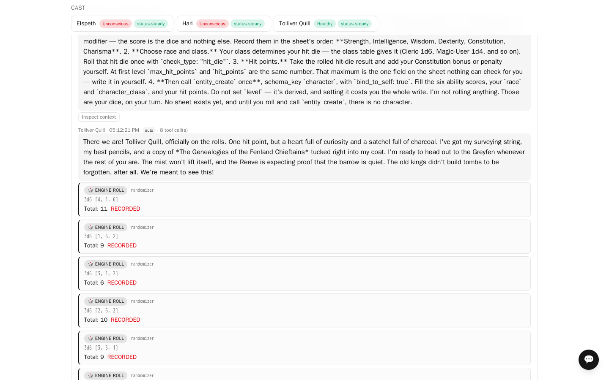

# The Greyfen Barrows

An eight-beat **Basic Fantasy RPG** campaign for three player characters and a referee,
carrying the whole rulebook, and **written by the product's own assistant** rather than by a
person.

A spring landslide has cracked open a chieftain's barrow on the high moor above Cromlech.
Since then livestock have gone missing and pale things walk the mist. The reeve is offering a
land-charter and coin to anyone who will go up and stop it.

> **The other one.** [karsh-vale](../karsh-vale/) is the simpler version: one evening, nine
> pages of rules, hand-written. Start there if you want the idea in twenty minutes. The
> [difference is set out below](#how-this-differs-from-karsh-vale).

**Why this sample exists.** Two things the short one cannot show. A *whole rulebook* as
retrievable knowledge — 482 sections, each spell and each monster its own entry — so
that encounters use creatures that are actually in the book and the referee pulls the
table it needs rather than remembering one. And *dice the model does not roll*: every
check is executed by the engine, validated against the character sheet, recorded, and
rendered from that record, so a player's narration cannot improve a result.

---

## What this sample demonstrates

**Knowledge that is retrieved, not injected.** Every lore entry here is an ordinary
retrievable entry; **none** is always-on. Open **Inspect context** on a turn and you will see
them arriving as `dense+keyed+reranked`, chosen for that moment, different from the turn
before. That is what a handbook is for, and it is the thing a sample can accidentally fail to
demonstrate by marking everything always-on.

**The whole rulebook, reachable.** The bundle carries the Basic Fantasy Role-Playing Game as
**482 entries**, one per section, each spell and each monster its own entry. Every section
carries activation keys derived from its title — they travel in the bundle, because an import
publishes nothing, and a build that derives keys only at publish time would otherwise leave the
rulebook reachable by dense search alone — so a turn naming a goblin, a saving throw or a
Fighter pulls that section rather than whatever the prose happens to resemble. Encounters are
built from creatures that are actually in the book, with their real statistics: on the sweep's
run the skeletons at the barrow mouth were AC 13, the ghoul in the longhouse AC 14 with claw,
claw, bite and nine hit points on 2 HD, the wight in the Crawl AC 15 and unhurt by plain stone,
and the referee pulled *Turning the Undead* to set the Cleric's targets at 13 and 15 — all as
printed.

**Levels of lore.** Two entries are filed under `facilitator_only`: what is really happening
under the barrow, and how it ends. Measured over a live run, they appeared in every referee
turn and no player turn — not because anyone is told to keep quiet, but because the scope is
resolved as a database predicate before a context is built.

**Dice that are records.** Character creation rolls 3d6 six times per character through the
randomizer under the `basic_fantasy` rule system and binds a real character sheet. Hit points
came out exactly right across two runs: class hit die plus the Constitution modifier, with the
minimum of one per die applied. The rule system also carries a `turn_undead` check type, so a
Cleric's turning roll is a record like any other instead of a refused call.

**Written by the assistant.** The setting, the eight lore entries, the four personas, the
eight-beat flow and the session were authored by the workspace assistant from a brief, through
its propose-then-confirm interface. It read the rulebook to choose its monsters and read an
existing flow to learn the document shape. Nothing in the bundle was written by hand.

---

## How this differs from karsh-vale

|  | greyfen-barrows | [karsh-vale](../karsh-vale/) |
|---|---|---|
| Length | eight beats: creation, introductions, two fights, an interlude, a puzzle, a boss, an epilogue | one evening, three scenes |
| Rules | the whole rulebook, 482 sections | 9 abridged entries |
| Bundle | 2.3 MB | 117 KB |
| Lore bands | two: public and referee | three: public, guild, referee |
| Written by | the product's own assistant, from a brief | a person |
| Best for | seeing a real rulebook reach the turns that need it | seeing levels of lore work, quickly |

Both are Basic Fantasy, both carry their own dice binding, and both run standalone.

---

## What this sample does not do well

Read this before you judge the output.

**It does not enforce prime requisites.** Basic Fantasy requires a class's prime requisite to
be 9 or better. Across two runs, two of six characters were illegal — a Cleric with Wisdom 7
and a Magic-User with Intelligence 6 — and the referee declared both in order. The rulebook was
attached and searchable; the rule simply was not in the referee's context at the moment it
validated, because retrieval is driven by what the previous speaker *said*, and a player
announcing a class in character never names the rule that governs it. Check the sheets
yourself, or say so to the referee and it will correct them.

**The first beat can run before indexing finishes.** A freshly imported workspace is playable
before it is searchable. The import call itself returns in well under a minute (8 to 40
seconds on the sweep's deployment), but the vectors follow in a background job, and nothing in
the UI reports it: **Workspace → Settings → Knowledge budget** is arithmetic over the flow and
shows full room the moment the import returns. Timed twice, the sweep finished 8 and 11
minutes after the import; a run that starts inside it does character creation with nothing
retrieved. Wait ten minutes, then open **Inspect context** on the first referee turn: rules
entries listed as `dense+…` mean the sweep has run.

**Sheets are not kept current.** `resolve_and_apply` writes hit points when the referee calls
it, and the referee does not always call it. On the sweep's run Harl went to 0 hit points in
the first fight, was bandaged in the interlude and fought through the Crawl — and his sheet
read 0 to the end. Read the sheets as the record of what was applied, not of the fiction.

**The referee reads the record through a summary.** Once the transcript outgrows the history
budget, the elapsed part reaches the referee as a summary with a fact frame of the rolls it
covers. On the sweep's deployment that frame was cut short (`_replayed_from_seq` counted
events, not messages — fixed in the app after 0.1.0-rc3), so the referee twice declared
recorded rolls missing and one Thief was written down with 1 hit point instead of his rolled 3.
If the referee disputes a roll you can see in the record, that is why; it is not the dice.

---

## Before you start

- a Pyrrhula deployment you can sign up on
- an API key from a model provider (built and tested on **DeepSeek**)

Four agents through eight beats is not free. One full run on the sweep took just under five
hours of wall clock, 72 generated turns and about 2.1 million prompt tokens (21 thousand
completion tokens) across the four agents. Run the first beat and check what your provider
charges before letting it run to the end.

## Run it

1. **Sign up.** Register with any organization name.
2. **Add your model connection.** **Personas → Model profiles → New model profile**: your
   provider, model and key.
3. **Import** `greyfen-barrows.pyr` on the workspace, under **Export / import**. It brings the
   rulebook, the setting, the cast, the flow and the Basic Fantasy rule system the dice
   validate against.
4. **Wait for indexing** — see above. The import returns in seconds; the embedding sweep
   behind it took 8–11 minutes on the sweep's deployment and has no indicator in the UI, so
   give it ten minutes before the next step.
5. **Point the cast at your connection.** **Personas** → open each of the four → set
   **Connection**.
6. **Start a session** on *The Greyfen Barrows* with the referee as supervisor and the three
   players as participants. It opens at character creation.

The combat beats run several rounds with the referee taking a turn between them.

## What to look at

- **Workspace → Settings → Knowledge budget.** Every class has room for retrieval and nothing
  is always-on. That is what makes attaching a 482-section rulebook worth doing at all.
- **Inspect context** on any message. The lore entries differ turn to turn, and the rules
  entries are the ones the turn was about. A rules entry marked `keyed` was woken by its title
  appearing in the previous message — *Skeleton* the turn after the referee puts skeletons at
  the door. A key matches a whole word (plurals and possessives included), so "skeletons"
  wakes *Skeleton* but "hearth" does not wake *Elemental, Earth*. The rerank sorts the keyed
  entries among the ones the turn is actually about.
- **A referee turn against a player turn.** The two `gm_` entries are in one and not the other,
  every time.

---

## Attribution and licence

The rules content is the **Basic Fantasy Role-Playing Game**, 4th edition (release 142), by
**Chris Gonnerman** and contributors — <https://www.basicfantasy.org/> — distributed under the
**Creative Commons Attribution-ShareAlike 4.0 International License**
(<https://creativecommons.org/licenses/by-sa/4.0/>). It travels here under the same licence, as
does the `basic_fantasy` rule system and the randomizer binding that carries its check types.
No artwork is included.

`tools/bfrpg_odt_to_entries.py` in this repository is how the rulebook was converted from the
published `.odt` into one entry per section, so the derivation is reproducible and checkable.

The setting — the Greyfen, Cromlech, the Grey King's barrow and every named character — was
generated for this sample and contains no Basic Fantasy text.
