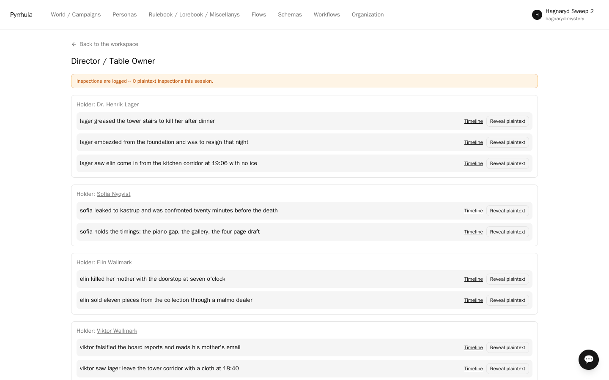

# The Hägnaryd Case

A closed-house murder for six agents: one investigator and five suspects, one of whom did
it. Everyone is lying about something; the question is which lies matter.

**Why this sample exists.** Every character holds private information the others cannot
see — not because their prompt asks them to keep quiet, but because the text is *not in
their context*. The murderer's account of the killing exists in exactly one agent's
context, and no amount of clever questioning by another agent can pull it out of the
system, because it was never there to pull.

Two people in this house planned to kill Ingeborg Wallmark that evening. Only one of them
did.




---

## Before you start

You need:

- a Pyrrhula deployment you can sign up on,
- an API key from a model provider (this was built and tested on **DeepSeek**, which costs
  very little for a run like this).

Six agents talking is not free. Run a few turns first and check what your provider
charges.

---

## Step 1 — Sign up

Open Pyrrhula and register. Pick any organization name.

When you land, you are in a workspace called **Default Workspace**, and your role in it is
**steward** — the seat that can both build the room and inspect it. You will need both
halves here.

## Step 2 — The Tabletop RPG workflow

The bundle names the workflow it was authored under, and importing pins it for you. You
do not have to select it first.

It matters because the workflow is what brings in the personality dials the cast uses —
how deceptive each character is, how readily their secrets surface under pressure.
Without them the cast is flat. If you would rather set it yourself, **Workflows →
Tabletop RPG** before importing does the same thing.

## Step 3 — Add your model connection

Go to **Personas** (top nav) **→ Model profiles → New model profile**, and fill in:

- **Name**: `DeepSeek` (anything you like)
- **Provider**: choose **Other…** and type `deepseek` (DeepSeek is not in the dropdown
  itself)
- **Model**: `deepseek-v4-pro` (or `deepseek-flash`, cheaper and faster). These are the
  names DeepSeek lists today; the older `deepseek-chat` still answered when this was last
  checked, but DeepSeek no longer lists it.
- **API key**: your key

Press **Test** before you save; it should say the model responded. Save. This is the only
place your key lives; it is never written into a bundle.

Other providers work too, and you can mix them — one connection per model, each persona
on whichever you like. Models differ in which sampling knobs they accept (OpenAI's GPT-5
models refuse any `temperature` other than 1, and the inspector carries `temperature
0.4`); Pyrrhula drops a parameter the model refuses by name and retries, so you do not
have to edit anyone's **Generation overrides (JSON)** to move them. A verified run put the
inspector on `gpt-5.6-terra` with her overrides exactly as shipped: the temperature was
dropped, `reasoning_effort: high` was kept, and she opened on her first turn.

## Step 4 — Import the case

Go to your workspace, click **Export / import** (top right of the workspace page) and upload
[`hagnaryd-mystery.pyr`](hagnaryd-mystery.pyr).

The report should tell you it imported:

- **6 personas** — `lind` (the investigator) and `viktor`, `elin`, `lager`, `sofia`,
  `marta`
- **11 secrets** — the private briefs
- **1 flow** — "The Hägnaryd Case": the inspector opens the scene and puts the first
  question; the suspects answer, eight turns a round, in reactive order (whoever has most
  reason to speak next — a quiet one may sit a round out); between rounds the inspector
  names the contradiction that matters and presses again. Three rounds of questioning,
  then her conclusion. She leads it; the suspects answer.
- **1 knowledge attachment** — the shared setting
- the vocabulary, *bound to the one already here* rather than duplicated

It will also say each persona was "bound to placeholder (connection did not travel)".
That is correct — that is step 5.

## Step 5 — Point the cast at your connection

Go to **Personas** and open each of the six. Set **Connection (model agent)** to the
connection you made in step 3, and save.

## Step 5½ — Optional: the forensic lab (an MCP server)

The case gives the inspector a menu of eight lab requests and a budget of **two**. The
referee's answers cannot travel inside the `.pyr` — a bundle is content, never code — so
the lab ships beside it as `evidence-server.py`, a single-file MCP server with no
dependencies. **The file contains every answer: do not open it if you intend to play.**

Run it on the machine that hosts your deployment:

```bash
python3 evidence-server.py --port 8765
```

Then attach it in the UI: **World / Campaigns → the workspace where you imported the
bundle → Settings → MCP servers → Register**

| field | value |
|---|---|
| key | `evidence` |
| url | `http://<your machine's LAN IP>:8765` (compose — e.g. `http://192.168.1.20:8765`, the address `ip -4 addr` shows on your wifi or ethernet interface) · `http://evidence-lab:8765` (Kubernetes, see below) |
| enabled tools | `evidence_check` |
| calls/session | `2` |

Leave *effectful* off — the lab only answers questions.

Then press **Test** next to the new server. It should say reachable and list
`evidence_check`. If it says the address is unreachable, the api container cannot route
to it: `localhost` is the container itself, and `host.containers.internal` resolves on
rootless podman but usually does not route from a compose network — use the LAN address.
Without this check the inspector still plays, but without the lab: she narrates a
"radio link down" instead of calling it, and nothing else says why.

**calls/session is the whole budget.** Set it to `2` and the inspector gets two lab
requests per interview; leave it blank and she gets as many as she likes. Nothing else
to configure, and nothing to reset between games.

What you get: the inspector radios a request by name during her own turns and the
answer arrives in the same turn. It also stays with her: each later turn of hers carries
her own earlier results (as "[Result of your evidence_check request …]" lines in her
history), so she builds on what the lab said instead of asking again. In a verified run
she spent the first call on the clothing and the second on the speech file, and her
verdict cited both. The flow offers the tool **only in her phases** — the suspects' phase
declares no remote tools, so nobody at the table can call the lab, and nobody else sees
her results. A repeated request costs a call like any other: Pyrrhula counts calls, not
distinct questions.

**Why the budget lives here and not in the lab.** The server keeps no count of its own,
deliberately: an external MCP server is sent only the model's arguments, never a trusted
session id, so any budget it kept would be one pool shared by every game hitting it — two
sessions running at once would silently starve each other. Pyrrhula knows the session, so
Pyrrhula holds the limit. A capped-out inspector gets a plain refusal she can reason
about (`session_call_cap_reached`) rather than an error, and two games can share one copy
of the lab without interfering.

(The same field is `max_calls_per_session` on `PUT /mcp-servers` if you prefer the API.)

**On Kubernetes**, pods cannot reach a process on your machine by `localhost`, so run
the lab inside the cluster instead — the script is dependency-free, so it is one
ConfigMap and a tiny Deployment (`evidence-server.k8s.yaml`, alongside this file):

```bash
kubectl -n pyrrhula create configmap evidence-server --from-file=evidence-server.py
kubectl apply -f evidence-server.k8s.yaml
```

Register with url `http://evidence-lab:8765` and the same **calls/session** value. One
pod serves any number of games — the per-session budget keeps them apart, so there is
nothing to restart between sessions.

Skipping this step is fine: her brief tells her that without the tool the radio link is
down and she must work from the dossier alone.

## Step 6 — Secrets are already switched on (check it)

**The bundle brings this with it now.** Importing sets the workspace to *Trusted to the
model* and installs the conduct rules the cast needs, so there is nothing to type here.
Open the workspace **Settings** tab if you want to see it: **Secret handling** should read
*Trusted to the model*, and **Conduct rules** should be filled in.

If you are importing into a workspace that already chose a secret mode, the import leaves
your choice alone — it only fills in what you had not decided. In that case set it
yourself, because the default, *Excluded*, keeps every brief out of every context: leak-
proof, but the suspects have nothing to hide and the case is not a case.

The two modes worth having:

- **Trusted to the model** — each suspect gets their own brief in context, directive and
  all, and the model plays it. No extra calls, no extra setup, and with a capable model
  this is the best drama: Elin *knows* what she did and lies about it coherently. What a
  character says about their own secret is the model's judgement — that is the trade.
- **Gated** — a small classifier decides per turn whether each secret may be concealed,
  hinted at, or revealed, and the verdict is enforced structurally. One extra model call
  per secret-holding turn. Choose this when you don't trust the talking model with the
  plaintext, or when you want reveals to formally change who knows what.

In every mode, no suspect ever sees another's brief — that part is enforced by the
system, not chosen here.

## Step 7 — Start the interview

Create a new session in the workspace:

- **Process definition**: `The Hägnaryd Case`
- **Supervisor**: `Kriminalinspektör Petra Lind`
- **Participants**: the other five
- **Agenda**: paste this —

```
The group interview in the library at Hägnaryd Manor, 09:00 Sunday. Kriminalinspektör
Petra Lind questions the five about the evening Ingeborg Wallmark was killed in her study.
Each answers in character. In the final round the inspector delivers a ranked list of the
five suspects and names the person she would arrest.
```

Then run it. The table speaks whatever language the inspector opens in: on
`gpt-5.6-luna` she opened in English; on `gpt-5.6-terra` she opened in Swedish and the
whole interview followed. If you want a particular language, say so in the agenda.

When it is over, **Reports** on the session page gives you the interview to keep:
**Transcript** is every line in order, **Session recap** is a narrative summary. Both
export to PDF.

---

## What you should see

**The cast knows the house.** Ask about the layout or the evening and you get the service
staircase, the gallery, the 19:30 dinner, the body found at 20:40. That comes from the
shared setting handbook, which every agent retrieves.

**Each suspect runs their own cover story.** These are not improvised — they come from
each character's private brief. In a verified run the very first answers were:

> **Dr. Henrik Lager:** "You asked about my phone, didn't you. […] I keep it on silent,
> always have. As for the message, I did not see it until well after dinner."

> **Elin Wallmark:** "I was next to the piano from half past six, working through some
> pieces. I did step out once — just past seven, to the kitchen for ice."

Lager's line is his brief's instruction for what to say if the text message comes up.
Elin's is her alibi, word for word. Neither agent was told to say it by the agenda; it is
in their context and in nobody else's.

**Nobody can see anyone else's brief.** Open the **Secrets** page and you will see all
eleven, each held by exactly one character. That holder list is what the system enforces:
Viktor's context contains Viktor's two secrets and no others.

## Playing it out

The investigator has two lab requests she can spend, listed at the end of her dossier
(recover the speech file, phone records, the pre-dinner clothing, the tower stairs, prints
in the suite, the safe, the guest rooms, phone searches). The case is solvable: six
independent items converge on one person, and no single one of them convicts.

If you want to check your table's answer, the solution is not in this repository on
purpose — the bundle contains only what the *characters* know. The investigator's dossier
is in her brief; you can read it on her persona page if you want to referee.

## Things worth knowing

- **If you use the Gated mode, consider giving the gate its own model.** The gate is a
  strict-JSON classifier. DeepSeek refuses schema-constrained output, so on DeepSeek
  Pyrrhula falls back to plain JSON mode with the schema in the prompt; that works
  (checked on `deepseek-v4-pro`, `deepseek-flash` and `deepseek-chat`), but a model with
  real structured output is the safer classifier. If the gate cannot produce a valid
  verdict, it *fails closed*: everything concealed, reason recorded. To pick a gate model,
  add a connection under **Personas → Model profiles** (a verified run used provider
  `openai`, model `gpt-4.1-mini`, which OpenAI still serves) and choose it under
  **Secret disclosure gate** there. Leave that unset and the gate runs on each speaking
  persona's own connection. The `gpt-4.1-mini` run produced 8 conceals, 4 hints and 1
  full reveal — including a character giving up the clue that breaks the case open, after
  which the rest of the table legitimately knows it.
- **The import report names the secrets.** Step 4's list of what was imported shows the
  first words of each secret, which gives the case away. If you intend to play, don't
  read that list closely.
- **Cost.** Six agents, plus one extra small call per secret-holding turn while the gate
  is on.
