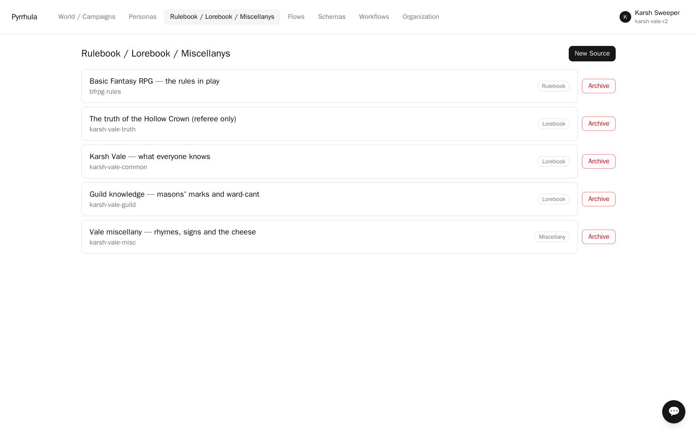
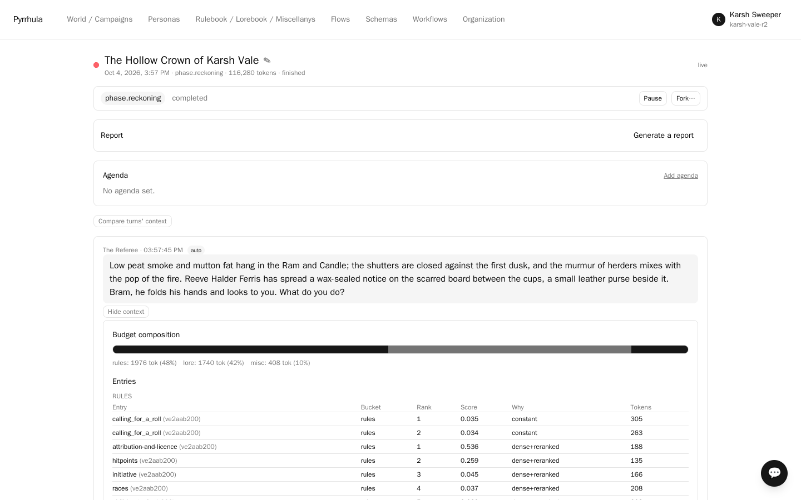

# The Hollow Crown of Karsh Vale

A **Basic Fantasy RPG** one-shot for three player characters and a referee, and the simpler
of the two tabletop samples here. One evening, one ruin, a small handbook.

Eleven sheep, two dogs and a boy named Aldo Fenn have gone missing from the upper pastures
of Karsh Vale, always on a moonless night, always within sight of the ruin the locals call
the Hollow Crown. The reeve is offering forty gold and a cottage for the winter to anyone
who ends it.

> **The other one.** [greyfen-barrows](../greyfen-barrows/) is the full version: the whole
> Basic Fantasy rulebook rather than a page of it, eight beats rather than one evening, and
> written by the product's own assistant rather than by hand. Start here to see the idea in
> twenty minutes; go there to see it carry a real rulebook. The
> [difference is set out below](#how-this-differs-from-greyfen-barrows).

---

## What this sample demonstrates

**Lore in three bands, by how widely it is known.** This is the centrepiece. Every phase of
the flow declares all three bands; the platform then intersects that list with what each
*principal* is entitled to read:

| Band | Who can retrieve it | What lives there |
|------|--------------------|------------------|
| `workspace_public` | the whole table | the Vale, the ruin, the disappearances, the tavern rumour of the tallowmen |
| `guild_lore` | the referee, **Bram** (a stonemason's son) and **Linnea** (college-trained) | how to read masons' marks, and how a binding inscription differs from a decorative one |
| `referee_lore` | the referee alone | what the Crown actually is, why the losses stopped eight days ago, and what the party's real decision will be |

Pip the halfling thief has no route to `guild_lore`, and **no player character has any route
to `referee_lore`**. That is not an instruction anyone can forget or be argued out of: scope
membership is resolved as a SQL predicate on every retrieval, so the text cannot reach their
context. When Bram reads the tool marks and tells the others, the knowledge enters the
fiction the way it should — because a character who plausibly knew said it out loud.

**Knowledge is retrieved, not pasted in.** Every entry here is an ordinary retrievable entry
with activation keys, except one: the note about how this platform's dice work, which is
about every turn and is therefore always-on. Open **Inspect context** on any message and the
lore differs turn to turn, chosen for that moment.

**The rules are common property.** The rulebook is filed under `rules` and open to everyone,
because a rule nobody can look up is not a rule. It is nine entries — an abridgement, enough
to run one evening. The referee still adjudicates; nobody is guessing at the arithmetic.

**Dice are records, not prose.** The resolve phase carries the randomizer and the referee is
told to call it and narrate what it gave — including when it goes badly. A result that was
rolled is the record; a number a model invented is not.

Percentile thief skills succeed by rolling *under* a number, while the
record counts a roll at or above its target as a success — so the always-on dice note tells
the referee to roll them against 101 minus the percentage (Pip listening at 30% rolls
`1d100` against 71). Same odds, and an outcome in the record that matches the story.

**Addressed, then reactive, turn order.** In the players' phase each character gets the
floor once, starting with whoever the referee just named (`addressed` order); then one
more turn goes to whoever *that* exchange named (`reactive`). So they answer the referee
and each other rather than marching in a fixed rota — and nobody is left out. (A purely
reactive phase follows names, and two characters who keep naming each other can hold the
floor for a whole evening while the third never speaks.)

---

## How this differs from greyfen-barrows

|  | karsh-vale | [greyfen-barrows](../greyfen-barrows/) |
|---|---|---|
| Length | one evening, three scenes | eight beats: creation, introductions, two fights, an interlude, a puzzle, a boss, an epilogue |
| Rules | 9 abridged entries | the whole rulebook, 482 sections, every spell and monster its own entry |
| Bundle | 115 KB | 2.3 MB |
| Lore bands | three: public, guild, referee | two: public and referee |
| Written by | a person | the product's own assistant, from a brief |
| Best for | seeing levels of lore work, quickly | seeing a real rulebook reach the turns that need it |

Both are Basic Fantasy, both carry their own dice binding, and both run standalone. Neither
needs the other.

---

## Run it

1. **Sign up.** Register with any organization name; you land in **Default Workspace** as its
   steward.
2. **Workflows → Tabletop RPG**, *before* importing. The bundle names it and the import would
   pin it anyway; choosing it first also keeps the bundle's own dice binding — the Basic
   Fantasy rule system — as the one the randomizer uses, rather than the pack's generic d20.
3. **Add a model connection.** **Personas → Model profiles → New model profile**: provider,
   model and your API key (built and tested on DeepSeek, `deepseek-chat`).
4. **Import** `karsh-vale.pyr` — on the workspace, **Export / import** (top right). It brings
   the four personas, the handbook, all five knowledge sources (rules, common lore, guild
   lore, referee lore and a little Vale miscellany), both scope bands, the rule system and
   the flow.
5. **Let the import finish indexing before starting a session.** A freshly imported workspace
   is playable before it is searchable: the import queues a background job that embeds the
   lore, and a session started before it finishes retrieves nothing by meaning for its first
   turns. Nothing in the UI shows that job's progress; on a deployment whose retrieval models
   are already installed it takes well under a minute, so doing step 6 first is enough of a
   wait. (**Workspace → Settings → Knowledge budget** is a different check — whether each
   phase has room to retrieve at all — and it is not an indexing indicator. For this flow it
   always shows a few amber "tight" notes — the misc and rules shares of some phases are
   small on purpose, because those phases are about scene and lore rather than rules —
   and they are expected.)
6. **Point the personas at your connection.** **Personas** → open each of the four → set
   **Connection (model agent)**. Each carries its own sampling overrides so a shared
   connection still produces four distinct voices.
7. **Start a session** on *The Hollow Crown of Karsh Vale*, referee as supervisor, the three
   players as participants.

Three scenes, then the referee brings it to a resting point with the real decision still in
front of the party. There is deliberately no "correct" ending written down.

### Seeing the bands work

Watch who reads the stone. When the party reaches the Crown, Bram can tell the others the
last builders were sealing something *in*, and Linnea can read the ward-cant over the
passage; Pip genuinely has nothing to add — not evasion, just absence.

Then check it rather than trust it. Open **Inspect context** on a turn of each character
(the same record is `GET /api/messages/{id}/manifest`, one row per retrieved chunk) and
compare the entries:

| Turn | What its context can contain |
|------|------------------------------|
| Pip | the rules, *Karsh Vale — what everyone knows*, the Vale miscellany |
| Bram, Linnea | all of that, plus *masons_marks* and *binding_scripts* from the guild source |
| the Referee | all of that, plus *truth_of_the_crown* and *campaign_beats* |

A referee-only entry in a player's turn, or a guild entry in Pip's, would be a leak.

### Seeing the dice

Every roll the referee makes through the tool is a ResolutionRecord: the expression, the
dice, the total, the target and the outcome, written by the server. The session's
**recap report** lists them under *Recorded facts*, ahead of any narration, so you can
check the referee's prose against what was actually rolled.

## The characters are written, not tracked

Here the three characters live in their persona briefs — stats, saves, gear and voice —
and the bundle carries no character sheets. That keeps the one-shot small, and it has two
consequences worth knowing. The dice tool rolls the bare die, and the referee moves the
bonus the brief states onto the target (Bram's +3 to hit against AC 13 is a `1d20`
against 10); and hit points are the referee's to keep in the fiction, not a
field that carries into the next session. A second session in the same workspace starts
the party fresh from their briefs.

---

## Attribution and licence

The rules content in this bundle is abridged and restated from the **Basic Fantasy
Role-Playing Game**, 4th edition (release 142), by **Chris Gonnerman** and contributors —
<https://www.basicfantasy.org/> — which is distributed under the **Creative Commons
Attribution-ShareAlike 4.0 International License**
(<https://creativecommons.org/licenses/by-sa/4.0/>).

The rules entries here are a derivative work of that text and are offered under the **same
CC BY-SA 4.0 licence**. No artwork from the rulebook is included.

The bundle also carries the **mechanics** themselves — the `basic_fantasy` rule system and
the tool binding that points the platform's one randomizer at it — so the one-shot is
playable on import without installing a ruleset separately. Those are a conversion of the
system (check types, expression grammar, the ability-modifier table), not of its prose, and
the same attribution and share-alike obligation travels with them. It is carried *inside* the
bundle as its own knowledge entry, so it reaches anyone who imports the file rather than only
someone reading this repository.

The setting — Karsh Vale, Ashmere, the Hollow Crown, the tallowmen, and every named character
— is original to this sample and contains no Basic Fantasy text.
