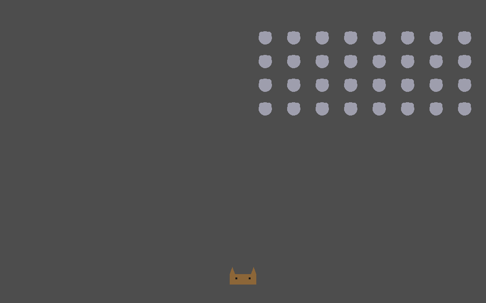

# Mice Invaders

A studio lead and a developer building a small game: Space Invaders, except the player is a
cat and the invaders are mice. One pair, one import, two parts — do the first, then the
second if your deployment can run code:

| | What happens | You need | Takes |
|---|---|---|---|
| **[Part 1 — Talk it through](#part-1--talk-it-through)** | The pair plans one increment and reviews it. A conversation: no repository, nothing runs. | a deployment and a model API key | a few minutes |
| **[Part 2 — Build it for real](#part-2--build-it-for-real)** | The developer builds that increment in a real Godot repository through a **coding harness** — reads the project, writes the rules and tests, runs them, fixes what fails — and a pull request comes out. | an **execution engine**, a GitHub fork and token | ~15 minutes |

Read Part 1 to see how the pair reasons; Part 2 to see a branch come out of it.




---

## Before you start

- A Pyrrhula deployment and a model API key. Built and tested on **DeepSeek**
  (`deepseek-chat`).
- For Part 2 also: an **execution engine** configured (a Docker or Podman socket, or
  Kubernetes — `docs/exec-engines.md`) that can **pull from `ghcr.io`**, a deployment that
  **offers the `opencode` harness** (a built-in; an administrator can withhold it), and a
  **GitHub account and token** — two accounts, if you want the review to be real.

## Step 1 — Sign up

Register with any organization name. You land in **Default Workspace** as its **steward**,
and you own the organization (the import adds a runtime image, which is an owner's action).

## Step 2 — Choose the Software Development workflow

**Before importing.** **Workflows** → **Software Development** — it provides the flows both
parts use, and it is what grants repository access at all.

## Step 3 — Add your model connection

**Personas** (top nav) **→ Model profiles → New model profile**: name `DeepSeek`, provider
`deepseek`, model `deepseek-chat`, and your API key.

## Step 4 — Import the project

Workspace → **Export / import** (top right) → upload [`mice-invaders.pyr`](mice-invaders.pyr).

It carries everything both parts use: the pair — **Studio Lead Ash** and **Senior Developer
Juno** — the **Build and review** flow, the studio conventions as a knowledge attachment, and
the runtime image `godot-node` for Part 2. No secrets; this sample has none. The report will
say:

- twice, that a persona was **bound to a placeholder (connection did not travel)** —
  expected; a sample must not ship anybody's API key. That is the next step.
- **`image:godot-node (being checked; usable once it passes)`** — Part 2's image. It is
  checked in the background; see 2.3. **Without an execution engine** it fails that check
  ("no execution engine to check the image on"): expected, and Part 1 does not need it.

If the report says `harness:dev wanted 'opencode', which this deployment does not offer`,
Part 1 is unaffected; Part 2 still runs but on the one-shot path — the model writes whole
files and never runs anything, so its test-and-fix loop will not happen.

## Step 5 — Point the pair at your connection

**Personas** → open `Studio Lead Ash` and `Senior Developer Juno` → set **Connection (model
agent)** to your connection. `Senior Developer Juno` shows **Harness: `opencode`** on the
roster — unused in Part 1, which has no repository; it is what lets Juno work in one in
Part 2.

---

## Part 1 — Talk it through

New session:

- **Process definition**: `Build and review`
- **Supervisor**: `Studio Lead Ash`
- **Participant**: `Senior Developer Juno`
- **Agenda**:

```
Build the cat-vs-mice browser game one increment at a time. Start with the pure rules: the
invader grid layout, how the formation marches and drops a row at an edge, and how it
speeds up as mice are destroyed. Keep the logic testable without a running scene.
```

### What you should see

The lead opens by naming **one** increment and what done means for it — not the whole
game. The developer answers with complete GDScript files rather than fragments, keeping
pure logic separate from scene code. The review phase either accepts the work or says
precisely what is wrong with it.

Both agents know the conventions (one increment per turn, complete files, the build stays
green, art is optional so a missing sprite never blocks) because those are in the shared
studio-conventions handbook, which every agent retrieves.

That is the conversation. Nothing was run: the files exist only in the transcript. Part 2
is where they become a branch.

---

## Part 2 — Build it for real

The same pair, now with a repository. Juno works through **opencode** inside a container —
a shell, the repository, and Godot to run the tests. Godot is not one of Pyrrhula's built-in
runtimes, so the container needs its own image; you do not build it — the bundle carried it,
public and pinned by digest, with the harness already inside, and Pyrrhula checks it on your
deployment before anything runs in it.

### 2.1 Fork the repository

Fork **[tuturu742/mice-invaders](https://github.com/tuturu742/mice-invaders)**. Its `main`
is deliberately a scaffold: a Godot project file, a small test runner, one self-test that
keeps a fresh clone green, and a README.

**Fork rather than use the upstream directly.** Delegated work pushes branches and opens
pull requests under the credential *you* give Pyrrhula, and that credential has to own the
repository it writes to.

### 2.2 Make the GitHub token(s)

A classic personal access token with the **`repo`** scope, able to push to your fork.
Pyrrhula seals it; it is never displayed again and never reaches the container.

**Optional, and worth it:** a *second* account's token, because GitHub will not let an
account approve a pull request it opened. The second account has to be a **collaborator on
your fork** first, or its token sees a `404`.

### 2.3 Wait for the image

**Repos → Images** → `godot-node`: *checking the registry* → *smoke test* → **ready**. The
image is about 2 GB on disk, so the first pull takes a few minutes; on a host that already
has it, under a minute. The smoke test runs it on **your** engine and confirms git and the
opencode version inside; only then does `godot-node` appear in the runtime list, pinned to
its digest.

If it is **refused** — your operator allows runtime images only from certain registries —
build it yourself from the Dockerfile in [Build the image yourself](#build-the-image-yourself).

### 2.4 Register your fork

**Repos → New repo**:

| Field | Value |
|---|---|
| Key | `mice-invaders` |
| Name | `Mice Invaders` |
| Source URL | `https://github.com/<you>/mice-invaders` |
| Access token | the token from 2.2 |
| Runtime | `godot-node` |
| Test command | `godot --headless --path . --script tests/run_tests.gd` |
| Build command | `mkdir -p build/web && godot --headless --export-release Web build/web/index.html && tar czf web.tgz -C build/web .` |
| Artifact file | `web.tgz` |

The build command runs only after the tests pass, and turns the branch into a web build of
the game — the fork's `export_presets.cfg` already has a `Web` preset for it. That build is
what the preview in 2.7 serves.

**If you made a second token:** open the repo → **Persona credentials** → bind
`Studio Lead Ash` to it.

### 2.5 Set a daily cap

**Usage → Limits** → a **per-persona daily token cap**. A run usually costs **40k–80k**
tokens, but not always: the lead sometimes writes a far more exacting work item and the
developer takes the long road to meet it — one test run of this README took ~350k for the
same agenda, and still ended green. A cap of **500k** per persona leaves room for that and
still stops a confused run with an "on hold" note rather than a bill.

### 2.6 Start the session

New session:

- **Process definition**: `Plan, Implement, Review, Merge`
- **Supervisor**: `Studio Lead Ash`
- **Participant**: `Senior Developer Juno`
- **Repos**: your fork
- **Agenda**:

```
Build Mice Invaders -- Space Invaders, except the player is a cat and the invaders are mice
-- as a first playable version: the rules, tested, and a scene that plays them in a browser.

Create exactly ONE work item, with a description that stands alone -- a coding agent reads
only it -- asking for all of:

- scripts/formation.gd: a plain RefCounted class, no scene dependencies, holding the
  swarm's rules: lay out a grid of mice (rows, columns, spacing, an origin); step the
  formation sideways by its current speed; when any mouse would cross a left or right
  bound, drop the whole formation by one row and reverse direction instead of stepping;
  and report how fast it should be moving given how many mice are left, so the swarm
  speeds up as it is destroyed and is fastest with one mouse remaining.
- tests/test_formation.gd extending res://tests/test_case.gd, covering the initial layout,
  a plain step, the edge case that drops and reverses, and the speed-up at full strength,
  half strength and one mouse left.
- scenes/main.tscn with scenes/main.gd, set as run/main_scene in project.godot: a playable
  game drawn with plain shapes (no art files): the cat moves left and right with the arrow
  keys and fires upward with Space; the swarm comes from Formation and marches, drops and
  speeds up by its rules; a shot that hits a mouse removes it; show "You win" when the
  swarm is gone and "Game over" when it reaches the cat's row, and press Enter to restart.
  The scene only wires the rules to input and drawing -- the rules stay in formation.gd.
- Read tests/run_tests.gd FIRST and follow the contract it already sets: every method named
  test_* is run, assertions come from the base class, no test framework is added.
- `godot --headless --path . --script tests/run_tests.gd` must exit 0, and
  `mkdir -p build/web && godot --headless --export-release Web build/web/index.html` must
  succeed (export_presets.cfg already has the Web preset; do not change it), before the item
  is done. tests/test_scaffold.gd should be deleted once there are real tests.
- README.md left alone.

Keep the rules pure and the numbers explicit. A reviewer should read the test file and know
what the swarm does without opening the implementation.
```

Do **not** press *Continue* after creating the session — creating it already starts the
autonomous run, and a second kick races the first.

### What you should see

`Studio Lead Ash` turns the agenda into a work item and delegates it. Then, in the
transcript: the container it created — on `godot-node`, pinned by digest — and **no harness
install**: the image's smoke test proved opencode is already inside, so the developer starts
at once. Juno reads `tests/run_tests.gd` **before** writing tests — the behaviour the persona
asks for and the clearest sign the harness is reading the repository rather than guessing.
Then `scripts/formation.gd`, the suite, the scene, whatever it got wrong, and the fix.

A bounded summary comes back in Juno's own voice — something like *"21 steps (bash ×8, read
×5, edit ×5, write ×2) · 135,288 tokens — all tests pass"* — and the pull request lands on
your fork with **CI: passed**, approved by the other account if you bound one. Ash reviews
the diff, and the session moves on to merge.

### 2.7 Play it

In the session, the **Play the build** card lists the pull requests that produced a build.
Pick the pull request under **Preview**, press **Deploy**, wait for **running**, then
**Copy link**. The link opens the game for anyone, with no account, until it expires:
arrows move the cat, Space fires, Enter restarts.

> **The game needs HTTPS, or `localhost`.** A Godot web build refuses to start anywhere
> else, with *"Secure Context - Check web server configuration (use HTTPS)"*. Installed on
> the machine you are using, open Pyrrhula as `http://localhost:5173` and the link works;
> any `*.localhost` name counts too, so the Kubernetes install's `http://pyrrhula.localhost`
> works as it is.
> Installed on another host, serve it over HTTPS: on the release images and in Portainer
> that is `PYRRHULA_TLS=self-signed` plus `PYRRHULA_TLS_SERVER_NAME=<the host's address>`
> (Pyrrhula's install guide, *HTTPS*). Accept the browser's certificate warning once and
> the link works for anyone who does the same.

---

## What this sample does not do well

- **The game is a first playable.** Drawn shapes, one level, no sound, no score — the rules
  are tested; the scene is not, beyond the export succeeding.
- **One pull request is not how the flow behaves by default.** Part 2's agenda forces a
  single work item because a showcase should be readable; left alone the lead plans several.
- **The image is large.** About 2 GB on disk (Node, Godot, the harness), pulled once per
  host. On a one-shot engine (Kubernetes, ECS) each delegation starts a fresh container; a
  node that has the image keeps it, and the harness is never reinstalled.
- **Godot 4.3 is pinned** in the image and in `project.godot`'s `config/features`. A newer
  Godot will offer to upgrade the project; the version skew is yours to manage.

## Taking it further

### Build the image yourself

The bundle's image was built by Pyrrhula itself, through a GitHub Actions builder, from this
Dockerfile (also under **Repos → Images → godot-node → History → How it was made**). To build
your own — a different Godot, more tools — **Repos → Images → Write a Dockerfile**, paste it,
choose **Bake in a harness: opencode**, **Save**, **Build** on a builder your administrator
declared (`docs/image-builds.md`), and pick the new image as the repo's runtime when it is
ready.

```dockerfile
FROM docker.io/library/node:20-bookworm AS templates

ARG GODOT_VERSION=4.3

# Only the web templates without thread support: they run from any static server, where
# the threaded ones need cross-origin isolation headers a plain file server does not send.
RUN curl -fsSL -o /tmp/templates.tpz \
      "https://github.com/godotengine/godot/releases/download/${GODOT_VERSION}-stable/Godot_v${GODOT_VERSION}-stable_export_templates.tpz" \
 && mkdir -p /out \
 && unzip -j -q /tmp/templates.tpz \
      templates/web_nothreads_release.zip templates/web_nothreads_debug.zip templates/version.txt \
      -d /out \
 && rm /tmp/templates.tpz

FROM docker.io/library/node:20-bookworm

ARG GODOT_VERSION=4.3

RUN apt-get update \
 && apt-get install -y --no-install-recommends unzip ca-certificates \
 && rm -rf /var/lib/apt/lists/*

RUN curl -fsSL -o /tmp/godot.zip \
      "https://github.com/godotengine/godot/releases/download/${GODOT_VERSION}-stable/Godot_v${GODOT_VERSION}-stable_linux.x86_64.zip" \
 && unzip -q /tmp/godot.zip -d /tmp \
 && mv "/tmp/Godot_v${GODOT_VERSION}-stable_linux.x86_64" /usr/local/bin/godot \
 && chmod +x /usr/local/bin/godot \
 && rm -rf /tmp/godot.zip

# Godot writes its config and import cache under $HOME, and looks for export templates
# under $XDG_DATA_HOME/godot/export_templates/<version>.
ENV HOME=/root
ENV XDG_DATA_HOME=/root/.local/share
ENV XDG_CONFIG_HOME=/root/.config

COPY --from=templates /out/ /root/.local/share/godot/export_templates/4.3.stable/

RUN godot --headless --version
```

Node is in the base because the harness installs with `npm`; the platform appends that
install itself, at the version your deployment runs, so it is not in the file. The first
stage pulls Godot's web export templates — only the no-threads pair, so the build runs
from a plain static server — without leaving the 1 GB template archive in the image.

### More

- **Keep building.** Start another session on the same fork with the next increment —
  a score, lives, mice that shoot back — and play each pull request's build before you
  merge it. The **Build command** and **Artifact file** from 2.4 are what make any green
  branch playable; a repo without both has no preview.
- **Compare the two parts.** Read Part 1's and Part 2's transcripts side by side: one
  reasons about the work, the other does it.
- **Turn the harness off** on `Senior Developer Juno` and run Part 2 again: the one-shot path
  writes whole files and never runs the suite. The diff is the argument for harnesses.
