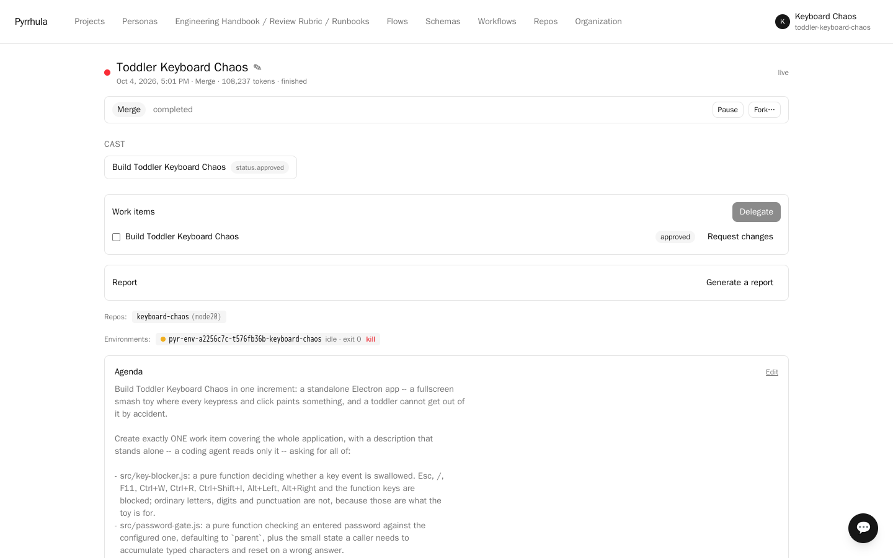
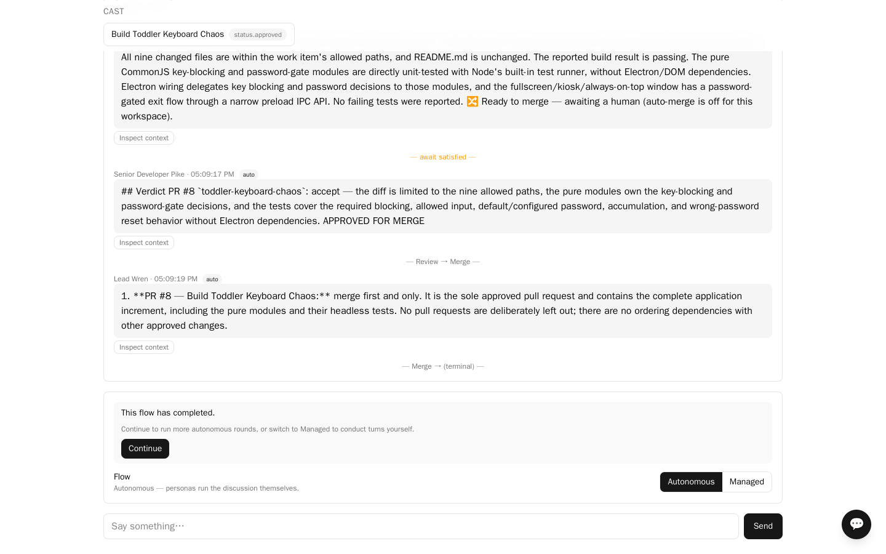

# Toddler Keyboard Chaos

A lead and a senior developer building a real application in a real repository: a
fullscreen smash toy for toddlers, as an Electron desktop app. The developer works through
a **coding harness** — an agent loop with a shell inside its own container, which reads the
repository, edits files, runs the tests and iterates before anything is committed.

**Why this sample exists.** Every other sample here is a conversation. This one produces a
pull request. It is the smallest honest version of delegated software work: someone decides
what done means, someone else builds it where the tests can actually run, and the result is
reviewed against the task rather than against taste — with the review filed on GitHub under
a different identity from the one that opened the pull request, because an account cannot
approve its own.





The app is a good subject for it because its acceptance criteria are *forced* to be
headless. A browser cannot hold `Esc`, `/`, `F11` or `Ctrl+W`; a desktop shell can. But a
test container has no display, so the key-blocking rules and the password gate have to be
pure functions with unit tests, and the Electron shell has to stay thin. That is a real
constraint, not a contrivance, and it is what gives the reviewer something falsifiable to
review.

---

## Before you start

- A Pyrrhula deployment with an **execution engine** configured (a Docker or Podman socket,
  or Kubernetes). Delegation runs code in a container; without an engine there is nowhere
  for it to run. See `docs/exec-engines.md`.
- A deployment that **offers a coding harness**. `opencode` ships as a built-in; an
  administrator can withhold it. Step 6 says how to tell.
- A model API key. Built and tested on **DeepSeek** (`deepseek-chat`).
- A **GitHub account and a token** — two accounts, if you want the review to be real.

---

## Step 1 — Fork the repository

Fork **[tuturu742/toddler-keyboard-chaos](https://github.com/tuturu742/toddler-keyboard-chaos)**.

Its `main` is deliberately a scaffold: a `package.json`, an empty `test/`, a licence and a
README. The working application lives in a pull request on the upstream repo, built by this
very sample — read it afterwards and compare it with what your own run produces.

**Fork rather than use the upstream directly.** You have no push access there and never
will: delegated work pushes branches and opens pull requests under the credential *you*
give Pyrrhula, and that credential has to own the repository it writes to. Anyone may open
a pull request *from* a fork of a public repo, but nobody can push a branch into someone
else's repository.

## Step 2 — Make the GitHub token(s)

A classic personal access token with the **`repo`** scope, able to push to your fork.
Pyrrhula seals it with its encryptor; it is never displayed again, and it never reaches the
container.

**Optional, and worth it:** a *second* account's token. GitHub will not let an account
approve a pull request it opened, so with one token the reviewer's approval is cosmetic.
Give the repository the first account's token and bind the lead persona to the second
account's (step 8). The second account has to be a **collaborator on your fork** first, or
its token sees a `404` rather than a permission error.

## Step 3 — Sign up

Register with any organization name. You land in **Default Workspace** as its **steward**.

## Step 4 — Choose the Software Development workflow

**Before importing.** **Workflows** → **Software Development**. This is the workflow that
grants repository access at all; importing first leaves the cast without it.

## Step 5 — Add your model connection

**Personas** (top nav) **→ Model profiles → New model profile**: name `DeepSeek`, provider
`deepseek`, model `deepseek-chat`, and your API key.

## Step 6 — Import the project

Workspace → **Export / import** (top right) → upload
[`toddler-keyboard-chaos.pyr`](toddler-keyboard-chaos.pyr).

The bundle carries **the cast and nothing else**: 2 personas, `Lead Wren` and
`Senior Developer Pike`. No flow, because selecting the workflow in step 4 already provided
*Plan, Implement, Review, Merge* — a second copy would appear in the picker under the same
name, with no way to tell which one this README meant. No secrets and no knowledge
attachments either; this sample's conventions live in the personas themselves.

The report will say, twice, that a persona was **bound to a placeholder (connection did not
travel)**. That is expected and it is the next step: a sample must not ship anybody's API
key, so the imported pair has no connection until you give it one.

**Read the import report.** If it says

> `harness:dev wanted 'opencode', which this deployment does not offer`

then the run will still work, but on the one-shot path: the model answers with whole files
and never executes anything, so most of this sample's point is absent. A harness key travels
in the bundle; the *command* never does, and it is resolved against your deployment's own
registry. Ask your administrator to make `opencode` available, or register your own harness
under **Harnesses**.

## Step 7 — Point the pair at your connection

**Personas** → open `Lead Wren` and `Senior Developer Pike` → set **Connection (model
agent)** to your connection. The bundle carries no connection on purpose: a sample must not
ship anybody's API key.

While you are there, confirm `Senior Developer Pike` shows **Harness: `opencode`** on the
roster, beside *Web search*. That switch is what makes the difference between an agent with
a shell and a model writing files blind.

## Step 8 — Register your fork

**Repos → New repo**:

| Field | Value |
|---|---|
| Key | `keyboard-chaos` |
| Name | `Toddler Keyboard Chaos` |
| Source URL | `https://github.com/<you>/toddler-keyboard-chaos` |
| Access token | the token from step 2 |
| Runtime | `node20` |
| Test command | `npm test` |

Pyrrhula clones your fork into its own hosted store. Delegated containers clone *that* over
a scoped, short-lived token and never talk to GitHub at all; only the platform pushes back
to your fork.

**If you made a second token:** open the repo → **Persona credentials** → bind `Lead Wren`
to it. That is what turns its verdict into a review GitHub will accept.

## Step 9 — Set a daily cap

**Usage → Limits** → a **per-persona daily token cap**. An agent loop is many calls per
task; a confused one on a cheap model can spend a great deal before it gives up. With a cap
the run stops with an "on hold" note instead of a bill. A few hundred thousand tokens is
ample for this sample — a successful run here costs roughly **50k–150k**.

## Step 10 — Start the session

New session:

- **Process definition**: `Plan, Implement, Review, Merge`
- **Supervisor**: `Lead Wren`
- **Participant**: `Senior Developer Pike`
- **Repos**: your fork
- **Agenda**:

```
Build Toddler Keyboard Chaos in one increment: a standalone Electron app -- a fullscreen
smash toy where every keypress and click paints something, and a toddler cannot get out of
it by accident.

Create exactly ONE work item covering the whole application, with a description that
stands alone -- a coding agent reads only it -- asking for all of:

- src/key-blocker.js: a pure function deciding whether a key event is swallowed. Esc, /,
  F11, Ctrl+W, Ctrl+R, Ctrl+Shift+I, Alt+Left, Alt+Right and the function keys are
  blocked; ordinary letters, digits and punctuation are not, because those are what the
  toy is for.
- src/password-gate.js: a pure function checking an entered password against the
  configured one, defaulting to `parent`, plus the small state a caller needs to
  accumulate typed characters and reset on a wrong answer.
- test/key-blocker.test.js and test/password-gate.test.js using node:test and
  node:assert/strict, covering the blocked keys, the allowed keys, the right password, a
  wrong one, and the reset. `npm test` must pass, headless.
- main.js and preload.js: a thin Electron main process -- one fullscreen, kiosk,
  always-on-top window, before-input-event calling into the pure blocker, and an exit path
  that only closes the window once the gate says the password was right.
- index.html and renderer.js: a full-window canvas that paints a shape in a random colour
  wherever a key is pressed or the mouse is clicked.
- package.json updated with an electron devDependency and a start script, keeping test as
  `node --test test/`.
- README.md left alone.

The Electron shell stays thin on purpose: there is no display in the test container, so
anything that only works inside a running window cannot be verified. The pure functions
carry the tests; the shell only wires them up.
```

Do **not** press *Continue* after creating the session — creating it already starts the
autonomous run, and a second kick races the first.

---

## What you should see

`Lead Wren` turns the agenda into a work item — a real record, not a list in a message —
and delegates it. Then, in the transcript:

- a **container** line: the environment it created, and on which engine
- a few minutes of quiet while the harness installs itself and the agent *works* inside
  the container — lists the files, reads the scaffold, writes `src/key-blocker.js`, runs
  `npm test`, reads what failed, fixes it. None of that is posted step by step; it comes
  back as the next item
- **🔀 Opened #1** — a real pull request on your fork, with its link, the size of the diff
  and *CI: passed* (the number is whatever GitHub assigns next on your fork), followed by a
  **bounded summary in Pike's own voice**: how many steps, which tools, what it concluded,
  how many tokens. Something like
  *"16 steps (write ×9, bash ×3, read ×3, glob ×1) · 37,465 tokens — All 21 tests pass."*
- `Lead Wren` reviewing the diff against the work item, and either approving it or sending
  it back with specifics — in which case Pike reworks it in the same container and you see
  a second round

On GitHub: the pull request authored by your first account, and — if you bound the second —
`APPROVED` by the other. Nine files, `npm test` green.

**What it cost, and where to see it.** Every model call the harness made went through
Pyrrhula's own inference proxy, so it is in **Usage** under `purpose='delegation'`. No
provider key ever entered the container: the agent got a short-lived token scoped to the one
connection its persona was given, which is why the cap in step 9 applies to it at all.

---

## What this sample does not do well

- **One pull request is not how the flow behaves by default.** The agenda above forces a
  single work item because a showcase should be readable. Left to itself, the lead splits
  the work into several items and delegates them in waves — which is better practice and a
  worse thing to read.
- **Each item branches from `main` independently.** A second work item that depends on the
  first landing will fail its tests until it is merged. That is honest, and it is why the
  flow ends with a recommended merge order rather than merging for you.
- **The app is not previewable.** Previews serve a build artifact over HTTP, and this is a
  desktop app: the renderer half would serve, but without the key-blocking that is the
  entire point. Nothing worth deploying.
- **A cheap model flails.** On `deepseek-chat` a run is typically 50k–150k tokens. A weaker
  model can spend ten times that discovering the same thing, which is what the cap is for.

## Taking it further

- **Let the lead split the work.** Delete the "exactly ONE work item" paragraph from the
  agenda and watch it plan properly. Expect several pull requests and a merge order.
- **Turn the harness off** on `Senior Developer Pike` and run the same agenda. The one-shot
  path asks a model for whole files and never runs them; comparing the two diffs is the
  clearest demonstration of what a harness buys.
- **Stop reinstalling the harness.** Every run installs opencode into `node20` first —
  about a minute. **Repos → Images → Write a Dockerfile → Start from: Node 20 with opencode
  baked in**, build it on a builder your administrator declared, and pick the image as the
  repo's runtime: delegations then start working at once (`docs/image-builds.md`).
- **Restrict what the container may reach.** `docs/exec-engines.md` covers the egress
  allowlist and the CPU/memory limits — worth turning on before you let an agent run
  arbitrary commands on a machine you care about.
